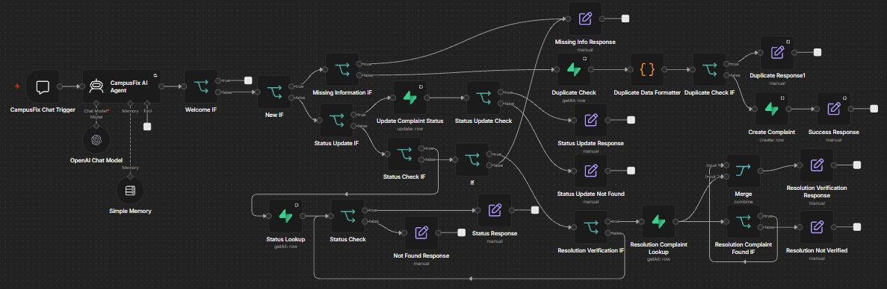
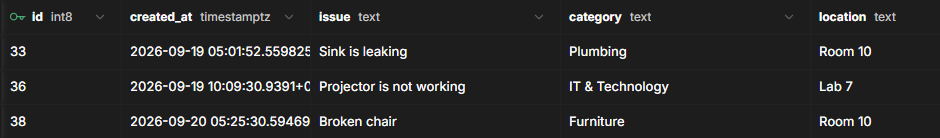
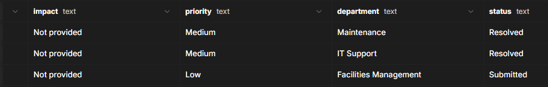

# CampusFix 🏫

An AI-powered campus complaint management system built with **n8n, OpenAI, and Supabase**.

CampusFix helps students report campus problems and check the status of their complaints through an AI-powered chat interface.

## ✨ Features

* **AI Complaint Processing:** Extracts important information from students' messages.
* **Complaint Categorization:** Organizes complaints by category, location, impact, and priority.
* **Complaint Tracking:** Looks up existing complaints and their status.
* **Status Updates:** Supports updating complaint statuses.
* **Duplicate Detection:** Checks for potentially repeated complaints.
* **Missing Information Handling:** Requests additional details when needed.
* **Resolution Verification:** Supports checking whether a reported issue has been resolved.
* **Image Uploads:** Allows users to attach images to their messages.

## 🛠️ Technologies Used

* **n8n** — Workflow automation and AI-agent orchestration
* **Supabase** — Database for complaint records
* **OpenAI** — AI language model integration
* **JSON** — Workflow export and configuration

## ⚙️ How It Works

1. A student sends a message through the chat interface.
2. The AI agent interprets the request.
3. The workflow determines whether the user is reporting a problem, checking a complaint, or requesting a status update.
4. The workflow uses conditional routing and Supabase operations to process the request.
5. CampusFix returns an appropriate response.

## 📸 Project Screenshots

### CampusFix Demo

### Supabase Database

## 📂 Workflow

The exported n8n workflow is available here:

[CampusFix n8n Workflow](workflow/CampusFix-n8n-workflow.json)

## 🎯 Project Goals

* Apply artificial intelligence to a practical campus problem.
* Learn workflow automation and database integration.
* Practice conditional logic, data processing, and system integration.
* Build a practical project demonstrating applied computer science skills.

## 👩‍💻 Project Background

Developed as a practical AI project at **Iqra Girls College** under the guidance of **Usma Jahanzaib**.

---

*This repository documents the project workflow, screenshots, and development information.*
